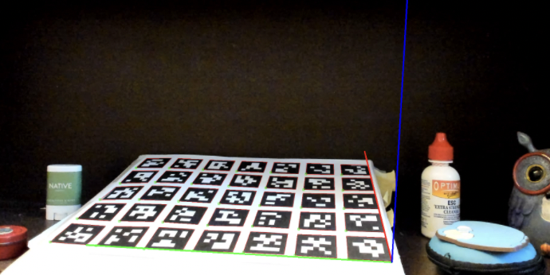
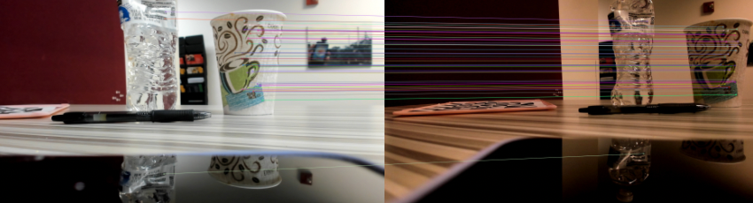
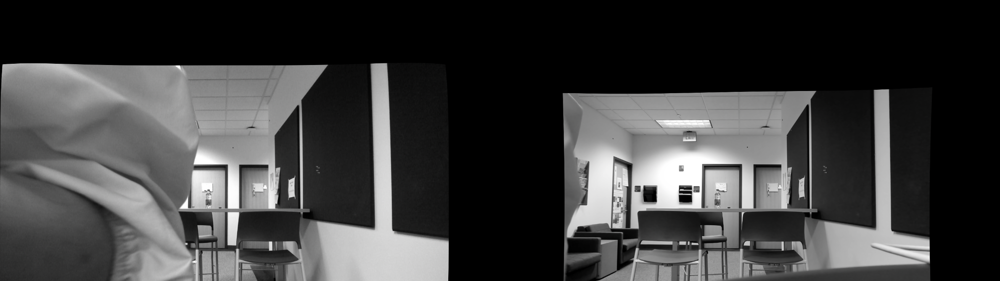
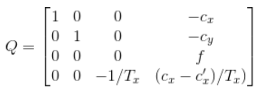
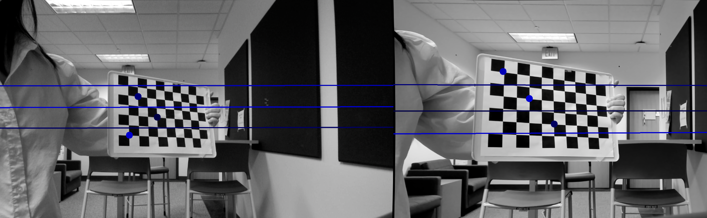
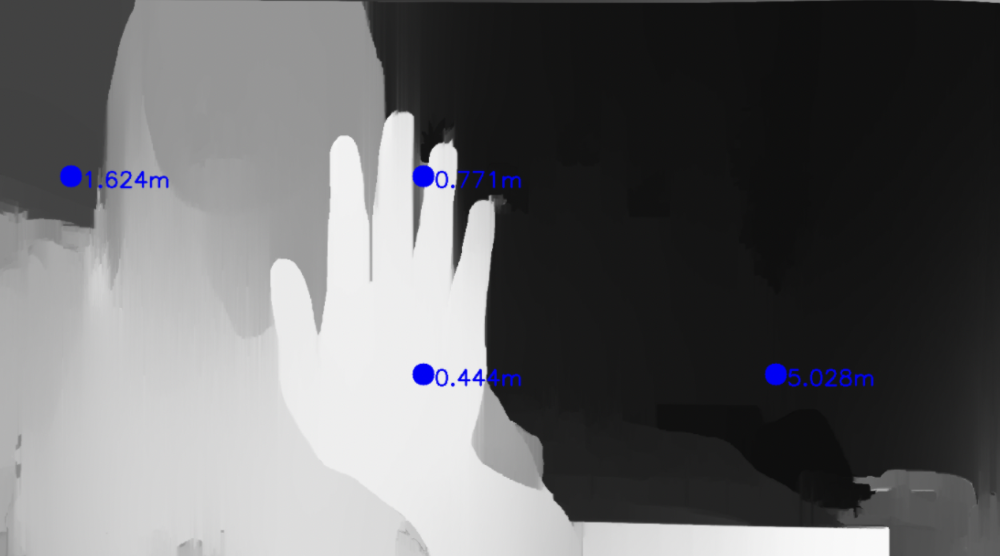
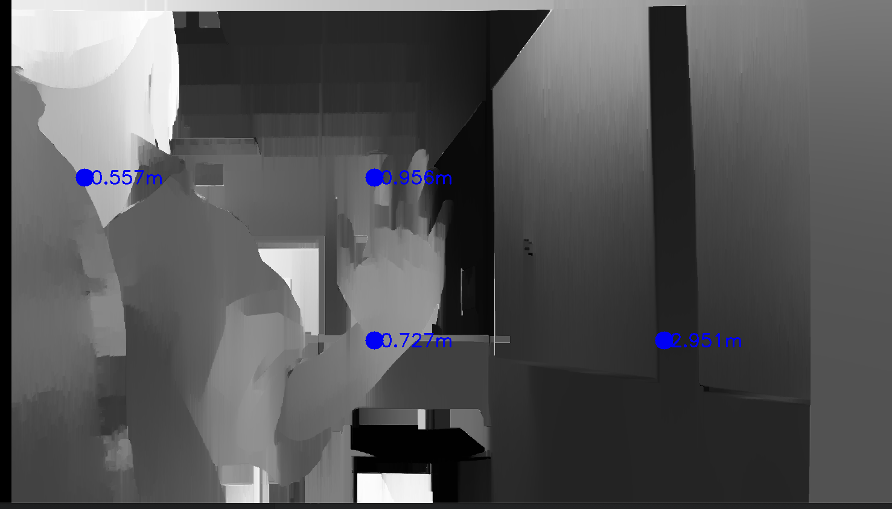

# Stereo Calibration and Depth Estimation 

1. [Background](#background)
2. [File Hierarchy](#file-hierarchy)
3. [How to Run](#how-to-run)


# Background
This repo contains tooling for multi-view camera calibration,
stereo rectification, and depth estimation. 

# File Hierarchy
 
```bash

######  Relative Pose estimation #########

# Estimate camera pose wrt world 
estimateCameraPose.py
# Estimate relative transformation between two cameras 
calcRelativePose.py


######  Rectification/Depth Estimation #########

# Generalized program to capture and save real-time streams from two cameras 
captureTwoVideos.py
# Visualize epipolar lines between images 
drawEpipolarLinesFLANN.py
drawEpipolarLinesChessboard.py

# Calibrate, Rectify images and store stereo coeffs
stereoCalibrateAndRectify.py
# Visualize disparity map
calcDisparityMap.py 


####### For 2D feature matching  ########
featureMatch2D.py

############ Misc #############
# contains gridboard/checkerboard
setup/
# store calibration params (K, D)
calib_left.yaml
calib_right.yaml

# Generating Aruco grid 
genArucoGridBoard.py
# Other utility functions 
utils.py


```

# How to Run 

*Note: for more detailed descriptions of what each program does, read the docstring at the top of each file*. 

<br>

## Camera Pose Estimation Pipeline


If you haven't already, run ```genArucoGridBoard.py``` and print out the generated Aruco grid board to use as the world reference plane.


Run ```estimateCameraPose()``` on the left and right cameras, separately (make sure to specify the correct '--type' in the argparser). This calculates the relative pose of the camera with respect to the world plane (plane of Aruco markers). 


**Aruco Board Estimation**

  


Then, run ```calcRelativePose.py``` which computes the relative transformation between the left and right cameras. 

<br>

## 2D Feature Matching
```featureMatch2D.py```: Given two input images corresponding to the left/right cameras, this program performs feature matching using ORB, SIFT, and SIFT + FLANN. The resulting matches are saved under ```match2d/```. 

  

<br>

## Depth Estimation Pipeline 
```captureVideos.py```: 
Capture video streams from your right and left cameras saving paired images to ```capture_left/``` and ```capture_right/``` folders. Make sure to capture images of the chessboard from various angles/distances for optimal calibration. 

<br>

```stereoCalibrateAndRectify.py```: 
Using the calibrated camera parameters K1, D1, K2, D2, this program calls ```stereoCalibrate()``` and ```stereoRectify()``` to obtain the Q matrix, fundamental matrix F, essential matrix E, etc... The stereo coefficients are then stored in ```stereo_coeffs.txt```.


Rectified Images: 
  


Q Matrix: 

  

<br>

```drawEpipolarLinesChessboard.py```: A good way to check rectification outputs is to visualize the epipolar lines. This means for each point in one image, the corresponding point in the other image can be found along a horizontal line. This function undistorts images using 
the parameters in ```stereo_coeffs.txt```, finds three corners of interest, and draws
lines. 

  

```calcDisparityMap.py```: Reads two video streams corresponding to the left/right cameras and loads stereo coefficients. Performs undistortion/remapping on each pair of frames, then calls ```gen_depth_map()``` which uses a Stereo SGBM matcher and WLS filter to visualize a smooth disparity map. 
The program also calculates depth from disparity using the formula 

```
z = (baseline * focal) / p
```

  

   


Note: Since depth and disparity are inversely proportional, closer objects should appear brighter in the disparity map. 


